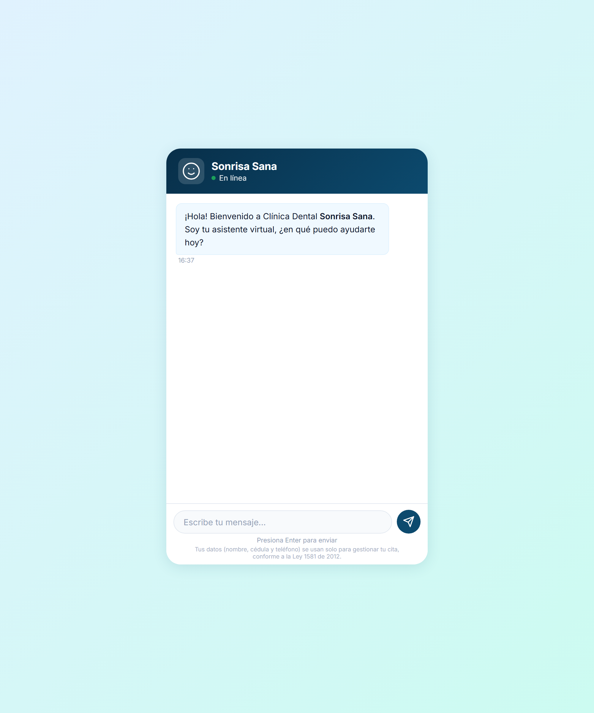
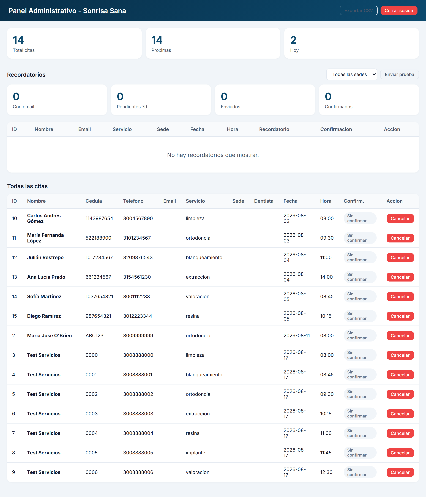
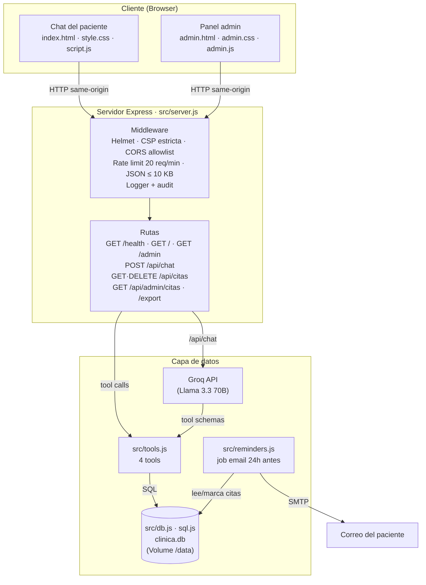
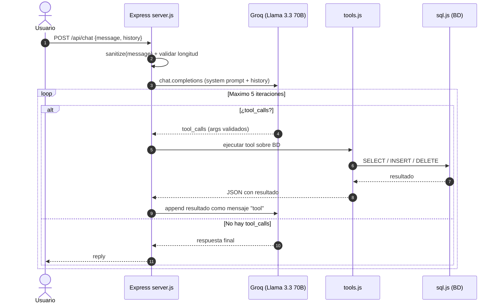
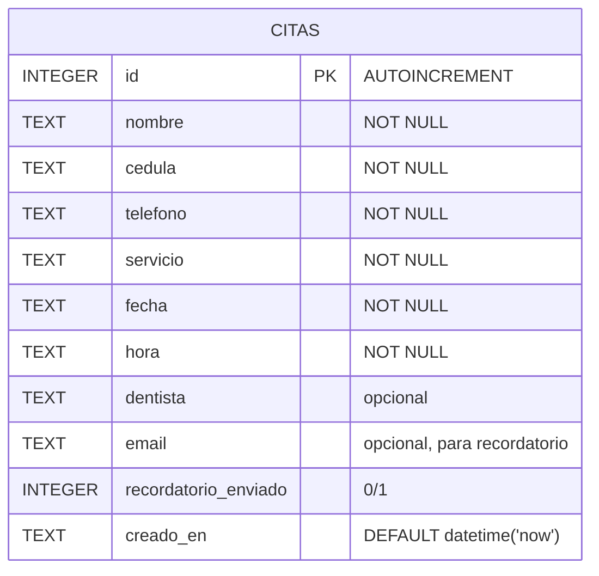
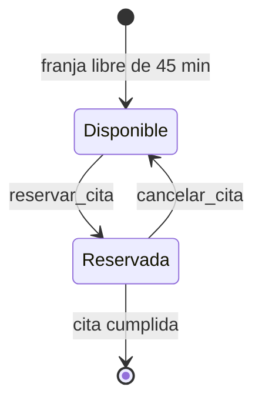

# Chatbot Clínica Dental Sonrisa Sana

[](https://github.com/Hisantirness/chatbot-clinica-dental/actions/workflows/ci.yml)
[](#)
[](https://nodejs.org)
[](https://expressjs.com)
[](https://sql.js.org)
[](https://groq.com)
[](https://vitest.dev)
[](https://railway.app)
[](LICENSE)

Chatbot web inteligente de atención al cliente para clínica dental. Responde preguntas frecuentes, consulta disponibilidad y **reserva citas reales** en base de datos, todo mediante lenguaje natural.

---

## Demo

La app está corriendo en producción: **[chatbot-clinica-dental-production.up.railway.app](https://chatbot-clinica-dental-production.up.railway.app)**

## Screenshots

Chat del paciente:



Panel administrativo:



## Arquitectura

### Vista general



### Flujo del chatbot (tool calling loop)



### Esquema de la base de datos



### Ciclo de vida de una cita



### Componentes

| Componente | Archivo | Responsabilidad |
|------------|---------|-----------------|
| **Servidor HTTP** | `src/server.js` | Express, middleware de seguridad, rutas, auth admin, loop de tool-calling |
| **Herramientas** | `src/tools.js` | Lógica de negocio: disponibilidad, reserva, consulta y cancelación de citas |
| **Recordatorios** | `src/reminders.js` | Job que envía recordatorios por email 24h antes de la cita (no-op sin SMTP) |
| **Base de datos** | `src/db.js` | Abre/guarda la BD SQLite (sql.js), crea tabla `citas` si no existe y migra columnas nuevas con `ensureColumn` (idempotente) |
| **Contexto del LLM** | `src/faq-context.js` | System prompt + 14 FAQs de la clínica |
| **Inicialización** | `src/init-db.js` | Crea la BD solo si no existe (corre en `npm start` y en Railway) |
| **Chat UI** | `public/script.js` | Frontend del chat, historial, indicador de escritura, retry |
| **Admin UI** | `public/admin.js` | Panel admin, login con token, estadísticas, CSV |
| **Config** | `vitest.config.mjs` | Aísla la DB de pruebas por proceso |

### Decisiones de arquitectura

- **SQLite vía sql.js** — Cero dependencias de servicios externos; la BD es un solo archivo portable. Se exporta y guarda con `saveDB()` tras cada escritura.
- **Tool calling del LLM** — El modelo decide cuándo tocar la BD; el servidor solo valida argumentos y ejecuta. Esto permite lenguaje natural sin parseadores propios.
- **Validación doble** — Las tools validan en `tools.js` (teléfono colombiano `3XXXXXXXXX`, fecha válida, horario disponible) y el servidor valida inputs del cliente (longitud, tipo).
- **Auth por Bearer token** — `ADMIN_TOKEN` con `crypto.timingSafeEqual` (constante de tiempo, sin comparación vulnerable). El panel envía el token en header `Authorization`, nunca en la URL.
- **Persistencia serverless** — `DB_PATH` apunta al Volume de Railway (`/data/clinica.db`), así la BD sobrevive deploys.


## Retos técnicos resueltos

Este proyecto no es un chatbot genérico: cada problema de producción real se resolvió y quedó documentado.

- **Tool calling multi-turno con LLM** — El modelo decide cuándo llamar `consultar_disponibilidad`, `reservar_cita`, `consultar_mis_citas` o `cancelar_cita`, con un loop de máximo 5 iteraciones y retry automático ante rate-limit de Groq (backoff progresivo).
- **Zonas horarias en producción** — El servidor corría en UTC pero la clínica está en Colombia (UTC-5). `getFechaHoy()` usa `Intl.DateTimeFormat` con `America/Bogota` para que las fechas de citas sean correctas.
- **Persistencia en entorno serverless** — Railway no persiste el filesystem entre deploys. La BD SQLite (sql.js) se guarda en un Volume montado en `/data` vía `DB_PATH`, y `init-db.js` respeta una BD existente.
- **Cuota diaria de la API gratuita** — Groq free tier tiene límite de 14,400 req/día. El sistema detecta `429`/cuota agotada y responde al usuario con un mensaje amable en vez de fallar.
- **Bug de seguridad real encontrado y corregido** — La política CSP de Helmet bloqueaba los scripts inline del frontend. Se migró todo a archivos externos y `onclick` → `addEventListener`, manteniendo la protección CSP intacta.
- **Tests idempotentes** — Los tests escribían en la DB real y fallaban en la segunda corrida. Se aisló la DB de pruebas en un archivo temporal por proceso (`test-setup.mjs`).
- **Condición de carrera en reservas simultáneas** — sql.js mantiene la BD en memoria y no serializa escrituras por defecto. Se agregó un *write lock* (Promise-based) que envuelve el *check-then-insert* de las reservas y las cancelaciones, garantizando que dos reservas al mismo slot no puedan confirmarse a la vez.
- **Recordatorios seguros sin configuración** — El job de recordatorios por email es un *no-op* cuando no hay SMTP configurado: no construye transport ni envía, solo loguea. Así la app funciona en producción (Railway) sin credenciales y queda lista para activarse con `.env`.

## Tech Stack


| Capa | Tecnología |
|------|-----------|
| **Runtime** | Node.js 20 |
| **Framework** | Express 4 |
| **LLM API** | Groq (Llama 3.3 70B, tier gratis, 14,400 req/día) |
| **Base de datos** | SQLite via sql.js |
| **Frontend** | HTML + CSS + JS vanilla (sin frameworks) |
| **Testing** | Vitest (34 unit + 23 server + 11 reminders + 7 integración) |
| **CI/CD** | GitHub Actions + Railway |
| **Seguridad** | Helmet, CORS, rate-limit, sanitización XSS, panel admin con token |

## Features

### Chatbot inteligente
- Responde 14 FAQs de la clínica (horarios, servicios, precios, EPS, etc.)
- Consulta disponibilidad de citas en tiempo real
- Agenda citas recopilando todos los datos del paciente (correo opcional para recordatorio)
- Consulta y cancela citas existentes por teléfono
- Envía recordatorios automáticos por email 24h antes de cada cita
- Tool calling loop con Groq (máximo 5 iteraciones)
- Retry automático en rate-limit de Groq

### Gestión de citas
- `consultar_disponibilidad` — horarios libres para una fecha
- `reservar_cita` — agenda cita con nombre, cédula, teléfono, servicio, dentista preferido (opcional) y correo (opcional)
- `consultar_mis_citas` — lista todas las citas de un paciente
- `cancelar_cita` — cancela cita verificando propiedad

### Recordatorios por email
- Job automático (`setInterval`) configurable con `REMINDER_INTERVAL_MINUTES` (default: 30 min, `0` lo desactiva)
- Envía recordatorio exactamente 24h antes de la cita, en zona horaria de Colombia (UTC-5)
- Solo a citas con correo registrado y nunca reenvía (columna `recordatorio_enviado`)
- **No-op seguro**: sin `SMTP_*` y `EMAIL_FROM` configurados, el job se omite y no rompe el servidor
- Usa `nodemailer` (funciona con Gmail app password o cualquier proveedor SMTP)

### Seguridad
- Helmet: HTTP headers seguros
- CSP estricta sin `unsafe-inline` (scripts y estilos externos)
- `Permissions-Policy` que niega cámara, micrófono, geolocalización y pago
- CORS con allowlist de orígenes (rechaza orígenes desconocidos)
- Rate limit: 20 req/min en `/api/*`
- Validación: max 500 chars por mensaje
- Payload JSON limitado a 10 KB
- Sanitización XSS en inputs
- Logs JSON estructurados
- `ADMIN_TOKEN` protege la API de citas y el panel administrativo (comparación en tiempo constante)
- Token admin siempre por header `Authorization: Bearer`, nunca en la URL
- Export CSV sanitizado contra fórmula injection
- Audit logging de todas las operaciones administrativas
- Aviso de privacidad y consentimiento conforme a la Ley 1581 de 2012 (Habeas Data) al agendar citas

### Panel Admin
Panel web protegido por token para gestionar citas:

| Ruta | Descripción |
|------|-------------|
| `GET /admin` | Interfaz web del panel (login con token) |
| `GET /api/admin/citas` | Lista todas las citas ordenadas (requiere token) |
| `GET /api/admin/citas/export` | Descarga CSV de todas las citas (requiere token) |

Accede en `/admin` e ingresa tu `ADMIN_TOKEN`. Desde el panel puedes ver estadísticas, listar citas, cancelarlas y exportar a CSV.

### CI/CD
Pipeline automatizado en cada push a `master`:

```
npm ci → init-db → npm audit → lint → test → verify
```

### Deployment
La app se despliega automáticamente en **Railway** con cada push a `master` (auto-deploy):

- URL: https://chatbot-clinica-dental-production.up.railway.app
- **Volume** montado en `/data` para persistir la BD entre deploys
- **Health check** en `/health` para monitoreo de Railway
- **Inicialización** — Tanto el `Dockerfile` como `npm start` ejecutan `init-db.js` antes de levantar el servidor, creando la tabla `citas` si no existe (idempotente).

### Recordatorios por email (configuración)

El job se activa automáticamente al iniciar el servidor, pero **no envía nada hasta que configures SMTP** (no-op seguro). Pasos:

1. Crea una **app password** en tu cuenta de Gmail (Google Account → Seguridad → Verificación en 2 pasos → Contraseñas de aplicaciones).
2. Configura las variables de entorno:

```
SMTP_HOST=smtp.gmail.com
SMTP_PORT=587
SMTP_USER=tu-correo@gmail.com
SMTP_PASS=tu-app-password
EMAIL_FROM=Sonrisa Sana <tu-correo@gmail.com>
REMINDER_INTERVAL_MINUTES=30
```

3. Despliega (o reinicia el servidor). Cada 30 minutos el job busca citas de pacientes **con correo** cuya cita esté exactamente a 24 horas, envía el recordatorio y marca la cita para no reenviarla.

Sin estas variables, el job solo registra en logs que SMTP no está configurado.

## Privacidad

El chatbot recopila datos personales de los pacientes (nombre, cédula y teléfono) exclusivamente para gestionar sus citas. Este tratamiento cumple con la **Ley 1581 de 2012 (Habeas Data)** de Colombia:

- **Finalidad** — Los datos se usan solo para registrar, consultar y cancelar citas; no se comparten con terceros.
- **Consentimiento** — Al agendar una cita, el chatbot informa el aviso de privacidad y solicita la aceptación explícita del paciente antes de confirmar.
- **Derechos** — El paciente puede solicitar la corrección o eliminación de sus datos contactando a la clínica.
- **Almacenamiento** — Los datos residen en la base de datos SQLite del servidor (Volume de Railway), sin servicios de análisis ni tracking.

## Respaldo de datos

La base de datos vive en un solo archivo SQLite (`clinica.db`) dentro del Volume de Railway:

- **Copia manual** — El panel admin expone `GET /api/admin/citas/export` para descargar un CSV de todas las citas (respaldo de recuperación).
- **Snapshot del Volume** — Railway permite crear copias del volumen montado en `/data` desde el panel de la app; se recomienda un snapshot periódico.
- **Frecuencia sugerida** — Diaria si la clínica opera todos los días, o semanal para uso ligero.

## API

### `GET /health`
Health check para Railway.

```json
{ "status": "ok", "timestamp": "2026-07-31T00:00:00.000Z" }
```

### `POST /api/chat`
Envía un mensaje al chatbot.

```json
{
  "message": "¿Qué horarios tienen mañana?",
  "history": []
}
```

```json
{
  "reply": "Tenemos disponibles: 08:00, 08:45, 09:30, ..."
}
```

### `GET /api/citas?telefono=3001234567`
Consulta citas por teléfono. Requiere `Authorization: Bearer <ADMIN_TOKEN>`.

```json
{
  "citas": [
    {
      "id": 1,
      "nombre": "Juan Pérez",
      "cedula": "123456789",
      "telefono": "3001234567",
      "servicio": "limpieza",
      "fecha": "2026-08-10",
      "hora": "08:00"
    }
  ]
}
```

### `DELETE /api/citas/:id`
Cancela una cita por ID. Requiere `Authorization: Bearer <ADMIN_TOKEN>`. Para cancelar una cita propia, incluye el teléfono: `DELETE /api/citas/1?telefono=3001234567`.

```json
{ "exito": true, "mensaje": "Cita 1 cancelada exitosamente." }
```

## Estructura

```
chatbot-clinica-dental/
├── .github/workflows/ci.yml   # Pipeline CI
├── public/
│   ├── index.html              # Chat UI
│   ├── style.css               # Estilos responsive
│   ├── script.js               # Lógica frontend
│   ├── admin.html              # Panel admin UI
│   ├── admin.css               # Estilos del panel admin
│   ├── admin.js                # Lógica del panel admin
│   ├── screenshot.png          # Captura del chat
│   └── screenshot-admin.png    # Captura del panel admin
├── src/
│   ├── server.js               # Express server + job de recordatorios
│   ├── tools.js                # 4 herramientas del chatbot
│   ├── db.js                   # Conexión SQLite
│   ├── faq-context.js          # 14 FAQs + system prompt
│   ├── init-db.js              # Script de inicialización
│   ├── reminders.js            # Recordatorios por email (24h antes)
│   ├── tools.test.mjs          # 34 tests unitarios
│   ├── server.test.mjs         # 23 tests del servidor Express
│   ├── reminders.test.mjs      # 11 tests del job de recordatorios
│   ├── test-setup.mjs          # DB temporal aislada para tests
│   └── integration.test.mjs    # 7 tests de integración
├── vitest.config.mjs
├── Dockerfile
├── package.json
└── README.md
```

## Quick Start

```bash
# 1. Clonar
git clone https://github.com/Hisantirness/chatbot-clinica-dental.git
cd chatbot-clinica-dental

# 2. Instalar
npm install

# 3. Configurar API key (gratis en console.groq.com)
echo "GROQ_API_KEY=gsk_tu-api-key-aqui" > .env

# 4. Inicializar BD y arrancar
npm run init-db
npm start
```

Abrir `http://localhost:3000`

## Scripts

| Comando | Descripción |
|---------|-------------|
| `npm start` | Inicia servidor en puerto 3000 |
| `npm run dev` | Modo watch (recarga automática) |
| `npm test` | 68 tests locales (34 unit + 23 server + 11 reminders) — CI |
| `npm run test:server` | 23 tests del servidor Express |
| `npm run test:integration` | 7 tests contra Railway (usa la URL por defecto) |
| `npm run test:all` | Todos los tests (locales + integración) |
| `npm run init-db` | Crea BD solo si no existe |
| `npm run lint` | ESLint |

## Variables de Entorno

| Variable | Requerida | Descripción |
|----------|-----------|-------------|
| `GROQ_API_KEY` | Sí | API key de Groq |
| `ADMIN_TOKEN` | Sí* | Token para acceder al panel admin y API de citas |
| `PORT` | No | Puerto (default: 3000) |
| `DB_PATH` | No | Ruta de la BD (en Railway: `/data/clinica.db`) |
| `CORS_ORIGINS` | No | Orígenes permitidos separados por coma (default: dominio de producción en Railway) |
| `SMTP_HOST` / `SMTP_PORT` | No | Servidor SMTP para recordatorios (default puerto: 587) |
| `SMTP_USER` / `SMTP_PASS` | No | Credenciales SMTP (en Gmail, usar app password) |
| `EMAIL_FROM` | No | Remitente de los correos de recordatorio |
| `REMINDER_INTERVAL_MINUTES` | No | Intervalo del job en minutos (default: 30, `0` lo desactiva) |

*Se recomienda configurarlo. Si no está, los endpoints de citas quedan sin protección.

## Licencia

MIT © Santiago Villa
